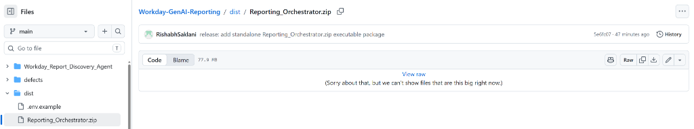
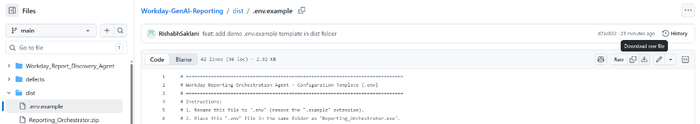
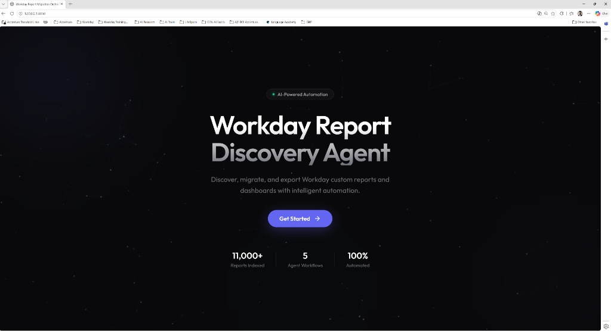
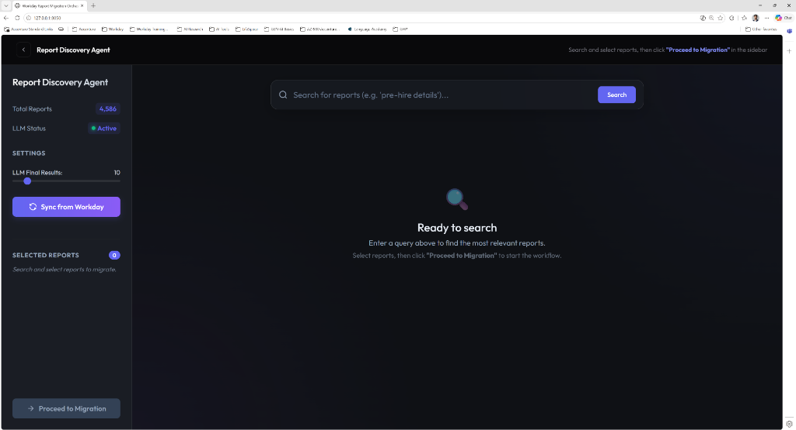
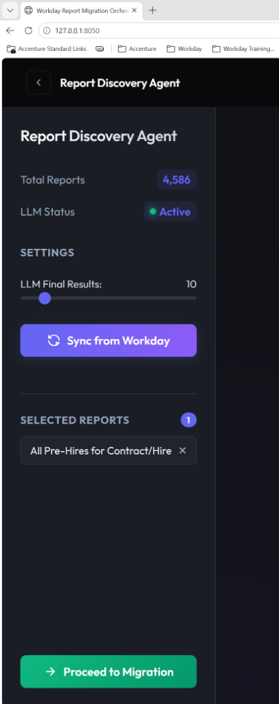
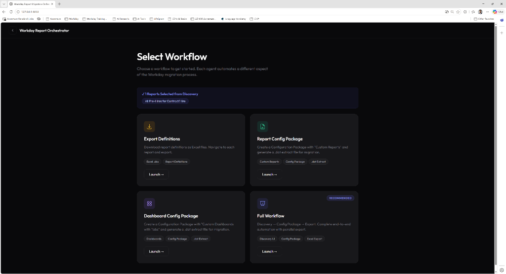
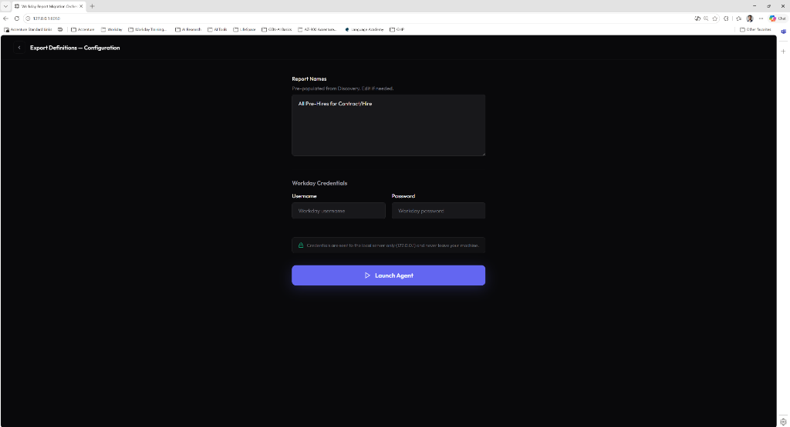
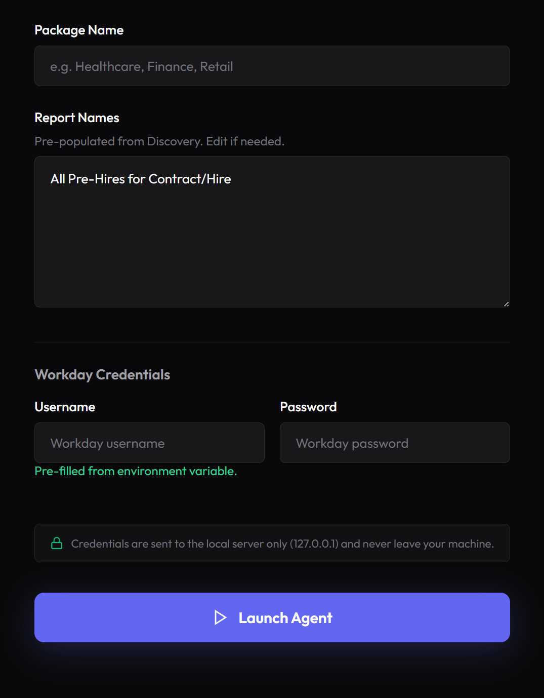
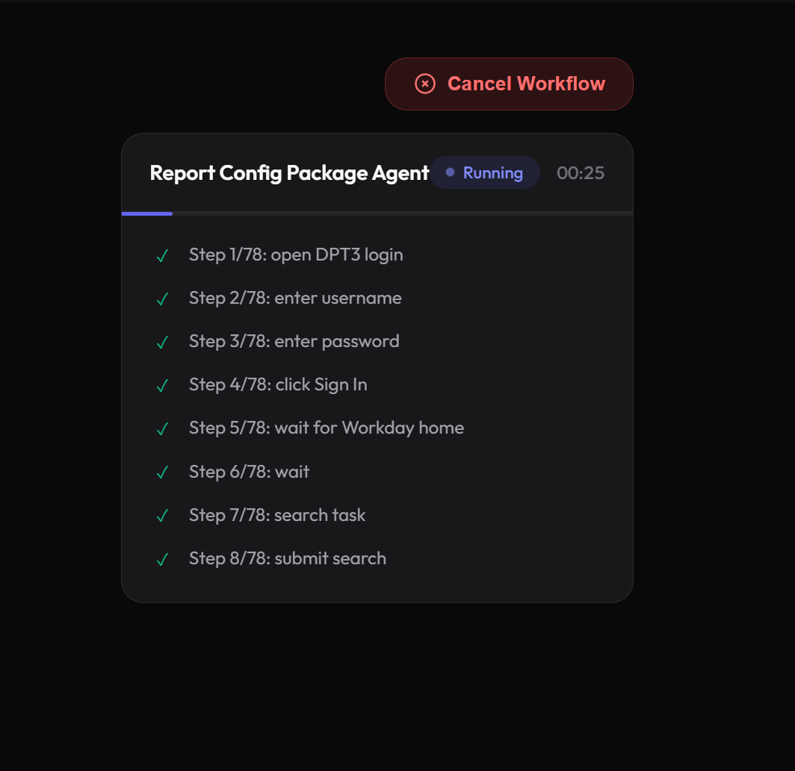
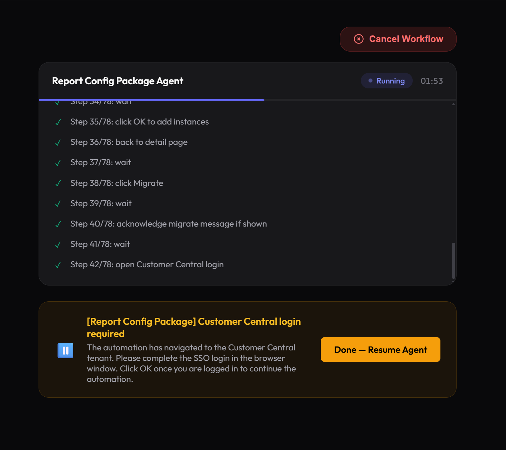

# 📘 Workday Reporting Orchestration Agent — User Guide

> **Version:** 1.0  
> **Last Updated:** August 2026  
> **Audience:** End users — no technical or programming knowledge required.

---

## Table of Contents

1. [Introduction](#1-introduction)
2. [Installation](#2-installation)
3. [Configuration](#3-configuration)
4. [Launching the Application](#4-launching-the-application)
5. [Using the Application](#5-using-the-application)
   - [5.1 Welcome Screen](#51-welcome-screen)
   - [5.2 Report Discovery Search Screen](#52-report-discovery-search-screen)
   - [5.3 Workflow Selection Screen](#53-workflow-selection-screen)
   - [5.4 Configuration Form](#54-configuration-form)
   - [5.5 Agent Progress Screen](#55-agent-progress-screen)
   - [5.6 Results Screen](#56-results-screen)
6. [Common Tasks (Step-by-Step)](#6-common-tasks-step-by-step)
7. [Troubleshooting](#7-troubleshooting)
8. [Frequently Asked Questions](#8-frequently-asked-questions)
9. [Getting Support](#9-getting-support)

---

## 1. Introduction

### What Does This Application Do?

The **Workday Reporting Orchestration Agent** is a Windows desktop tool that automates routine Workday reporting tasks. Instead of manually navigating through Workday screens one by one, this application opens a browser window and performs the work for you — automatically.

It can:

- **Find reports** — Search across thousands of available Workday reports using plain English queries (e.g., *"employee terminations by performance rating"*).
- **Migrate reports** — Automatically create a Configuration Package containing your selected Custom Reports and download the `.dat` migration file from Customer Central.
- **Migrate dashboards** — Same as above, but for Custom Dashboards with Tabs.
- **Export report definitions** — Download full report definition details as Excel (`.xlsx`) spreadsheets.

### Who Should Use This?

- Workday consultants who need to migrate reports between tenants.
- Team members who regularly export or package report definitions.
- Anyone who wants to save time on repetitive Workday reporting tasks.

### What You Need Before Starting

| Requirement | Details |
|---|---|
| **Computer** | Windows 10 or Windows 11 |
| **Browser** | Google Chrome must be installed on your computer |
| **Workday Access** | A valid Workday username and password for the tenant you are working with |
| **Internet Connection** | Required throughout the entire process |
| **AI Search Key** *(optional)* | A free API key for intelligent report searching (see [Section 3](#3-configuration)) |

---

## 2. Installation

### Step 1: Locate and Download the Application Package

1. In the GitHub repository, navigate to the **`dist/`** folder and click on **`Reporting_Orchestrator.zip`**.
2. Click on the **"View raw"** link in the center of the page. This will automatically start downloading the `Reporting_Orchestrator.zip` file to your computer.



> [!TIP]
> Alternatively, if you already received the ZIP file directly (e.g. from your team lead), locate it in your computer's `Downloads` folder.

### Step 2: Extract the Files (If ZIP)

1. Right-click on the downloaded `Reporting_Orchestrator.zip` file.
2. Select **"Extract All…"**
3. Choose a folder location on your computer (e.g., your Desktop or Documents folder).
4. Click **"Extract"**.

> [!CAUTION]
> Do **not** run the application directly from inside the ZIP file. You must extract it first.

### Step 3: Verify Required Files

Open the extracted folder. You should see the main executable:

| File | Purpose |
|---|---|
| `Reporting_Orchestrator.exe` | The main application (double-click to run) |
| `.env` | Configuration file (see Section 3 below on how to download and configure it) |

---

## 3. Configuration

Before launching the application for the first time, you need to set up a configuration file named `.env`. This file tells the application how to connect to the AI search service and contains your configuration settings.

### Step 1: Obtain and Open the Configuration File

#### Option A: Download the Template from GitHub
1. In the repository, open the **`dist/`** folder and click on **`.env.example`**.
2. Click the **"Download raw file"** button (download icon) in the top-right corner.



3. Move the downloaded `.env.example` file into the **same folder** where you extracted `Reporting_Orchestrator.exe`.
4. **Rename the file** from `.env.example` to **`.env`** (remove the `.example` extension).

#### Option B: If `.env` is Already in Your Folder
1. Find the file named **`.env`** in your application folder (it may appear as just `env`).
2. **Right-click** on the file → select **"Open with"** → choose **Notepad** (or any text editor).

> [!WARNING]
> Do **not** open this file in Microsoft Word or similar rich text editors. Use only **Notepad**, **Notepad++**, or **VS Code**.

### Step 2: Understanding Each Field

When you open the file, you will see content similar to this:

```
# AI Search Configuration
OPENAI_API_KEY=your_api_key_here
OPENAI_BASE_URL=https://api.groq.com/openai/v1
MODEL_NAME=llama-3.3-70b-versatile
BM25_TOP_N=30
LLM_TOP_K=5

# Workday Catalog Sync
WORKDAY_RAAS_URL=https://your-workday-url-here
WORKDAY_ISU_USERNAME=your_service_account
WORKDAY_ISU_PASSWORD=your_password
```

Here is what each field means:

| Field | What It Is | What to Enter | Required? |
|---|---|---|---|
| `OPENAI_API_KEY` | Your AI service key for smart report searching | A key that looks like `gsk_abc123...` (provided by your team lead or from [groq.com](https://groq.com)) | ✅ Yes — for AI search |
| `OPENAI_BASE_URL` | The address of the AI service | Keep the default value unless instructed otherwise | ✅ Yes |
| `MODEL_NAME` | Which AI model to use for searching | Keep the default value unless instructed otherwise | ✅ Yes |
| `BM25_TOP_N` | How many initial search results to consider | Keep as `30` (default) | No |
| `LLM_TOP_K` | How many final results to show | Keep as `5` (default) | No |
| `WORKDAY_RAAS_URL` | Your Workday report catalog address | Provided by your Workday admin (leave blank if unsure) | No |
| `WORKDAY_ISU_USERNAME` | Service account username for catalog sync | Provided by your Workday admin | No |
| `WORKDAY_ISU_PASSWORD` | Service account password for catalog sync | Provided by your Workday admin | No |

### Step 3: Enter Your Values

Replace the placeholder text with your actual values. For example:

```
OPENAI_API_KEY=gsk_hF2psDkMHjR(ExampleKey)
OPENAI_BASE_URL=https://api.groq.com/openai/v1
MODEL_NAME=llama-3.3-70b-versatile
BM25_TOP_N=30
LLM_TOP_K=5
```

> [!IMPORTANT]
> - Do **not** add quotes or spaces around the values.
> - Do **not** add spaces before or after the `=` sign.
> - Lines starting with `#` are comments and are ignored by the application.

### Step 4: Save the File

1. Press **Ctrl + S** to save.
2. Close Notepad.

You are now ready to launch the application.

---

## 4. Launching the Application

### Step 1: Find the Application

Navigate to the folder where you extracted the files and locate `Reporting_Orchestrator.exe`.

### Step 2: Start the Application

**Double-click** on `Reporting_Orchestrator.exe`.

### What Happens Next

1. **A small command window** (black window with text) may briefly appear. This is normal — it is the application starting up in the background. You can minimize it, but **do not close it**.

2. **Your web browser will automatically open** to a page at `http://127.0.0.1:8050`. This is the application's control panel running locally on your computer.

3. You will see the **Welcome Screen** with the title *"Workday Report Discovery Agent"* and a **"Get Started"** button.

> [!NOTE]
> The address `127.0.0.1` means the application is running **only on your computer**. Your data never leaves your machine through this application.

### First-Time Startup

The very first time you launch the application, it may take 15–30 seconds longer than usual because it needs to load the full report catalog (4,500+ reports) into memory. Subsequent launches will be faster.

> [!WARNING]
> If nothing happens after double-clicking the `.exe` file, see the [Troubleshooting](#7-troubleshooting) section.

---

## 5. Using the Application

The application guides you through a series of screens. Below is a detailed description of every screen, what it does, and what you should do on each one.

---

### 5.1 Welcome Screen



**What you see:**
- The title **"Workday Report Discovery Agent"**
- A badge: *"AI-Powered Automation"*
- A subtitle: *"Discover, migrate, and export Workday custom reports and dashboards with intelligent automation."*
- A large **"Get Started"** button
- Three statistics at the bottom: *11,000+ Reports Indexed*, *5 Agent Workflows*, and *100% Automated*

**What to do:**
1. Click the **"Get Started"** button to proceed to the Report Discovery screen.

---

### 5.2 Report Discovery Search Screen

After clicking "Get Started", you are taken directly to the **Report Discovery Agent** — an AI-powered search screen where you find and select the reports you want to work with.



**What you see:**

| Area | Description |
|---|---|
| **Top Bar** | Shows "Report Discovery Agent" with a hint: *Search and select reports, then click "Proceed to Migration" in the sidebar* |
| **Search Bar** *(center)* | Type your search query here (e.g., *"pre-hire details"*) |
| **Results Area** *(center)* | Shows matching reports with relevance scores and descriptions after you search |
| **Sidebar — Total Reports** *(left)* | Shows how many reports are in the catalog (e.g., 4,586) |
| **Sidebar — LLM Status** *(left)* | Shows whether the AI scoring engine is active (green = active) |
| **Sidebar — Settings** *(left)* | Slider to control how many final results are shown |
| **Sidebar — "Sync from Workday"** *(left)* | Button to refresh the report catalog from Workday *(optional)* |
| **Sidebar — Selected Reports** *(left, bottom)* | Shows the reports you have selected so far with a count badge |
| **"Proceed to Migration" button** *(left, bottom)* | Click this when you are done selecting reports |

**What to do:**

1. **Type a search query** in the search bar. Use plain English — for example:
   - *"employee terminations by performance"*
   - *"pre-hire details"*
   - *"headcount by department"*
2. Click the **"Search"** button or press **Enter**.
3. Wait a few seconds while the system analyzes and scores the results.
4. **Review the results.** Each result shows:
   - **Report Name** — the official name in Workday
   - **Relevance Score** — how closely the report matches your query (higher = better match)
   - **Explanation** — why this report was selected
   - **Details** — data source, report type, fields, and other metadata
5. **Click on a report** to select it. It will appear in the **"Selected Reports"** panel on the left sidebar.



6. Repeat steps 1–5 to search for and select additional reports.
7. When you are satisfied with your selections, click the **"Proceed to Migration"** button in the sidebar.

> [!TIP]
> You can remove a selected report by clicking the **✕** button next to its name in the sidebar.

> [!TIP]
> If the AI search is unavailable, the system will automatically fall back to keyword-based searching, which still works well.

---

### 5.3 Workflow Selection Screen

After clicking **"Proceed to Migration"**, you are taken to the workflow selection dashboard. Your selected reports are shown at the top of the screen.



**What you see:**

- A green banner at the top showing: **"✓ 1 Reports Selected from Discovery"** with the selected report names listed as tags.
- Four **workflow cards**, each representing a different task:

| Card | What It Does | When to Use It |
|---|---|---|
| **Export Definitions** | Downloads report definitions as Excel files | When you need report details in a spreadsheet format |
| **Report Config Package** | Creates a Configuration Package for Custom Reports and downloads a `.dat` migration file | When you need to migrate custom reports between Workday tenants |
| **Dashboard Config Package** | Creates a Configuration Package for Custom Dashboards with Tabs and downloads a `.dat` migration file | When you need to migrate dashboards between tenants |
| **Full Workflow** *(Recommended)* | Combines Config Package + Export into a single end-to-end automated process with parallel execution | When you want both the migration file and Excel exports in one go |

**What to do:**
1. Review the green banner to confirm your selected reports are correct.
2. Read the description on each card to decide which workflow suits your task.
3. Click the **"Launch →"** button on the card you want.

> [!NOTE]
> Your selected reports will automatically be carried forward into whichever workflow you choose. You do not need to re-enter them.

---

### 5.4 Configuration Form

After selecting a workflow, you will see a form where you provide the remaining details needed for that workflow.




**What you see:**

| Field | Description | Example |
|---|---|---|
| **Package Name** | A name for the migration package being created. This is used as a label in Workday. *(Not shown for Export-only workflow.)* | `Healthcare`, `Finance`, `Retail` |
| **Report Names** *(or Dashboard Names)* | Pre-populated from the Discovery screen. You can edit or add more names if needed. Enter one name per line. | `All Pre-Hires for Contract/Hire` |
| **Workday Username** | Your Workday login username | `john.smith` |
| **Workday Password** | Your Workday login password | *(your password)* |

**What to do:**
1. **Review the Report Names** field — it will already contain the reports you selected in the Discovery screen. Edit if needed.
2. Fill in the **Package Name** (if visible — not required for Export-only).
3. Enter your **Workday Username** and **Password**.
4. Click the **"Launch Agent"** button.

> [!NOTE]
> **Your credentials are secure.** As noted on screen: *"Credentials are sent to the local server only (127.0.0.1) and never leave your machine."*

---

### 5.5 Agent Progress Screen



After you click **"Launch Agent"**, the application begins automating your workflow. This screen shows you real-time progress.

**What you see:**

- **Agent name and status** — which agent is currently running (e.g., "Report Config Package", "Export")
- **Step-by-step progress** — each automation step is listed as it completes (e.g., "Navigating to Workday…", "Clicking Create Package…")
- **A "Cancel Workflow" button** — stops the automation if needed

**What to do:**

1. **Watch the progress.** Each step will appear in real time. A Chrome browser window will also open — this is the agent performing actions automatically. **Do not close this browser window.**

2. **SSO / Multi-Factor Authentication (MFA) Prompt:**
   If your organization uses Single Sign-On or MFA, you will see a **yellow banner** that says:

   > ⏸️ **Action Required**  
   > *Please complete the SSO login in the browser window.*

   When this appears:
   1. Switch to the **Chrome browser window** that the agent opened.
   2. Complete the SSO login or MFA verification manually (enter your code, approve the push notification, etc.).
   3. Once you have successfully logged in, come back to the application and click the **"Done — Resume Agent"** button.

3. The agent will continue from where it paused.

> [!IMPORTANT]
> During the SSO/MFA step, the agent is waiting for you. Take your time — there is no rush. The agent will remain paused until you click "Resume."

---

### 5.6 Results Screen



When all agents have finished, the results screen appears automatically.

**What you see:**

- **A success or failure banner** indicating whether the workflow completed successfully.
- **Details for each agent** that ran:
  - Agent name
  - Whether it succeeded or failed
  - How long it took (in seconds)
  - Any error messages (if something went wrong)
- A **"Back to Dashboard"** button to start another workflow.

**What to do:**

1. Review the results.
2. **If successful:**
   - For **Migration workflows** — your `.dat` configuration extract file has been downloaded to your computer's default Downloads folder or the location specified in Workday.
   - For **Export workflows** — your Excel (`.xlsx`) files are saved in the `exported_reports` folder inside the application folder.
3. Click **"Back to Dashboard"** to run another workflow, or simply close the browser tab and the command window to exit the application.

---

## 6. Common Tasks (Step-by-Step)

### Task A: Migrate Custom Reports to Another Tenant

**Goal:** Create a configuration package containing specific custom reports and download the `.dat` migration file.

1. Double-click `Reporting_Orchestrator.exe` to start the application.
2. Click **"Get Started"** on the Welcome Screen.
3. In the **Report Discovery** screen, search for your reports (e.g., *"terminations by performance"*).
4. Click on each report you want to select.
5. Click **"Proceed to Migration"** in the sidebar.
6. On the Workflow Selection screen, click **"Launch →"** on the **"Report Config Package"** card.
7. Enter a **Package Name** (e.g., `Healthcare`).
8. Verify the **Report Names** field is pre-populated with your selections.
9. Enter your **Workday Username** and **Password**.
10. Click **"Launch Agent"**.
11. If an SSO prompt appears, complete the login in the Chrome window, then click **"Done — Resume Agent"**.
12. Wait for the agent to finish. Your `.dat` file will be downloaded automatically.

---

### Task B: Full End-to-End Workflow (Recommended)

**Goal:** Search for reports, then automatically migrate and export them in one go.

1. Double-click `Reporting_Orchestrator.exe` to start the application.
2. Click **"Get Started"**.
3. In the **Report Discovery** screen, type a search query (e.g., *"termination by performance rating"*).
4. Click **"Search"** and review the results.
5. Click on each report you want to select.
6. When done selecting, click **"Proceed to Migration"** in the sidebar.
7. Click **"Launch →"** on the **"Full Workflow"** card *(marked "Recommended")*.
8. Enter your **Package Name**, **Workday Username**, and **Password**.
9. Click **"Launch Agent"**.
10. Handle any SSO/MFA prompts in the Chrome browser window.
11. Wait for completion. Both the `.dat` migration file and Excel export files will be generated.

---

### Task C: Export Report Definitions as Excel Files

**Goal:** Download report definitions as `.xlsx` spreadsheets.

1. Double-click `Reporting_Orchestrator.exe` to start the application.
2. Click **"Get Started"**.
3. In the **Report Discovery** screen, search for and select the reports you want to export.
4. Click **"Proceed to Migration"** in the sidebar.
5. Click **"Launch →"** on the **"Export Definitions"** card.
6. Verify the report names, then enter your **Workday Username** and **Password**.
7. Click **"Launch Agent"**.
8. Handle any SSO/MFA prompts.
9. When complete, find your exported Excel files in the `exported_reports` folder.

---

### Task D: Migrate Dashboards

**Goal:** Create a configuration package for Custom Dashboards with Tabs.

1. Double-click `Reporting_Orchestrator.exe`.
2. Click **"Get Started"**.
3. In the **Report Discovery** screen, search for and select the dashboards you want to migrate.
4. Click **"Proceed to Migration"** in the sidebar.
5. Click **"Launch →"** on the **"Dashboard Config Package"** card.
6. Enter a **Package Name** (e.g., `Finance`).
7. Verify dashboard names, then enter your **Workday Username** and **Password**.
8. Click **"Launch Agent"**.
9. Handle any SSO/MFA prompts.
10. Wait for the `.dat` file to download automatically.

---

## 7. Troubleshooting

### Problem: The application does not start when I double-click the `.exe` file

**Possible causes and solutions:**

| Cause | Solution |
|---|---|
| Windows security blocked the file | Right-click the `.exe` → **Properties** → at the bottom, check **"Unblock"** → click **Apply** → **OK**. Then try again. |
| Antivirus blocked the file | Temporarily disable your antivirus, or add the application folder to your antivirus exclusions list. |
| The file is still inside a ZIP archive | Extract the ZIP file first (right-click → "Extract All…"), then run the `.exe` from the extracted folder. |
| Windows SmartScreen warning | Click **"More info"** → then click **"Run anyway"**. |

---

### Problem: The browser does not open automatically

**Solution:**
1. Wait 10–15 seconds after starting the application.
2. If the browser still does not open, manually open Google Chrome and go to: `http://127.0.0.1:8050`
3. If you see a "This site can't be reached" error, the application may not have started correctly. Close the command window and try launching the `.exe` again.

---

### Problem: I see "Invalid configuration" or the AI search does not work

**Possible causes and solutions:**

| Cause | Solution |
|---|---|
| Missing or incorrect API key in the `.env` file | Open the `.env` file in Notepad and verify that `OPENAI_API_KEY` has a valid key. |
| Extra spaces or quotes in the `.env` file | Make sure there are no spaces around the `=` sign and no quotation marks around values. |
| The AI model name has changed | Ask your team lead for the current model name and update `MODEL_NAME` in the `.env` file. |
| No internet connection | The AI search requires an internet connection. Check your network. |

> [!TIP]
> Even if the AI search is not working, the application will automatically fall back to a keyword-based search. You can still find and select reports.

---

### Problem: The agent stops and shows "Action Required" (SSO/MFA)

**This is expected behavior, not an error.**

1. Switch to the Chrome browser window the agent opened.
2. Complete your organization's Single Sign-On or Multi-Factor Authentication process.
3. Return to the application and click **"Done — Resume Agent"**.

---

### Problem: The agent fails with an error message

**What to do:**
1. Read the error message on the Results Screen.
2. Common errors and their meanings:

| Error Message | What It Means | What to Do |
|---|---|---|
| *"Timeout waiting for selector"* | The application could not find a button or field on the Workday page | The Workday page may have changed or was slow to load. Try running the workflow again. |
| *"Navigation timeout"* | A Workday page took too long to load | Check your internet connection and try again. |
| *"Task cancelled by user"* | You pressed the "Cancel Workflow" button | This is intentional — no action needed. |
| *"net::ERR_CONNECTION_REFUSED"* | Cannot connect to Workday | Check your internet connection and VPN (if required). |

3. If the error persists, take a screenshot of the error message and contact support (see [Section 9](#9-getting-support)).

---

### Problem: I cannot find the exported Excel files

**Solution:**
- Excel files from the **Export** workflow are saved in a folder called `exported_reports` inside the same folder as the `.exe` file.
- Open the `exported_reports` folder to find your `.xlsx` files.

---

### Problem: I cannot find the downloaded `.dat` migration file

**Solution:**
- The `.dat` file is downloaded through the Chrome browser window during the migration process.
- Check your browser's default **Downloads** folder (usually `C:\Users\<YourName>\Downloads`).
- The file name typically contains the package name and the date, for example: `Healthcare_Config_Package_08_31_2026.dat`.

---

### Problem: Port already in use / Application shows a port error

**Solution:**
1. Close all browser tabs showing `127.0.0.1:8050`.
2. Close any command windows from previous application sessions.
3. Wait 10 seconds, then restart the application.
4. The application will automatically attempt to free the port if it detects a conflict.

---

## 8. Frequently Asked Questions

### Q: Is my Workday password stored anywhere?

**A:** No. Your password is only used during the current session to log into Workday through the automated browser. It is never saved to disk, logged, or sent to any external server. When you close the application, the password is discarded.

---

### Q: Can I run multiple workflows at the same time?

**A:** No. Run one workflow at a time. Wait for the current workflow to finish before starting a new one. You can return to the Dashboard after each workflow completes.

---

### Q: Do I need to be on VPN?

**A:** If your organization requires VPN access to reach Workday, then yes — make sure you are connected to VPN before launching a workflow.

---

### Q: What is the `.dat` file that gets downloaded?

**A:** The `.dat` file is a Workday Configuration Package extract. It contains the definitions for the custom reports (or dashboards) you selected. This file can be imported into another Workday tenant to migrate those reports.

---

### Q: What happens if I close the Chrome browser window during a workflow?

**A:** The workflow will fail because the agent can no longer interact with Workday. If you accidentally close the browser, go back to the application and click "Cancel Workflow", then start the workflow again.

---

### Q: Can I use this application on a Mac or Linux computer?

**A:** No. This application is currently designed for **Windows only** (Windows 10 or Windows 11).

---

### Q: What does "BM25 fallback" mean?

**A:** When the AI-powered search service is temporarily unavailable (due to rate limits or network issues), the application automatically switches to a simpler keyword-based search method called BM25. This still produces useful results — they just won't include AI-generated relevance explanations.

---

### Q: How do I update the report catalog?

**A:** If your `.env` file has the Workday RaaS configuration fields filled in (`WORKDAY_RAAS_URL`, `WORKDAY_ISU_USERNAME`, `WORKDAY_ISU_PASSWORD`), you can click the **"Sync from Workday"** button in the Report Discovery sidebar. This will refresh the local catalog with the latest reports from your Workday tenant.

---

### Q: The application says a model "does not exist." What do I do?

**A:** The AI model specified in the `.env` file may have been retired or renamed. Contact your team lead for the updated model name, then update the `MODEL_NAME` field in the `.env` file and restart the application.

---

## 9. Getting Support

If you encounter an issue that is not covered in this guide:

1. **Take a screenshot** of the error message or the screen where the issue occurred.
2. **Note the workflow** you were trying to run (Export, Report Migration, Dashboard Migration, or Full Workflow).
3. **Check the `defects` folder** — the application automatically captures screenshots when an error occurs during browser automation. These images can help with diagnosis.
4. **Contact your team lead or project administrator** with the above information.

---

> [!NOTE]
> This guide covers the standard usage of the Workday Reporting Orchestration Agent. For technical documentation, architecture details, or configuration of the AI search pipeline, refer to the `README.md` file included in the application package.
